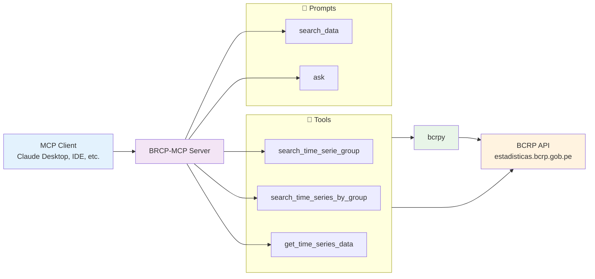

<div align="center">

# BRCP-MCP
#### **Model Context Protocol (MCP) Server for BCRP Economic and Financial Time Series Data**

---

### 👨‍💻 Author

**Ivan Yang Rodriguez Carranza**

[](mailto:ivanrodcar@outlook.com)
[](https://www.linkedin.com/in/irodcar)
[](https://github.com/rodcar)

</div>

---

## 📋 Table of Contents

- [🎯 Overview](#-overview)
- [🔧 Tools](#-tools)
- [💬 Prompts](#-prompts)
- [🚀 How to Use](#-how-to-use)
- [💡 Examples](#-examples)
- [🏛️ Architecture Diagram](#️-architecture-diagram)
- [📝 License](#-license)
- [🙏 Acknowledgments](#-acknowledgments)

---

## 🎯 Overview

BRCP-MCP is a **Model Context Protocol (MCP) server** that provides seamless access to economic and financial time series data from the **BCRP (Banco Central de Reserva del Perú)** - Peru's Central Reserve Bank. This server enables AI assistants and applications to search, explore, and analyze Peru's economic indicators, financial statistics, and monetary data through a standardized MCP interface.

---

## 🔧 Tools

| Name | Input | Description |
|------|-------|-------------|
| `search_time_series_groups` | `keywords` | Search for time series groups using one or multiple keywords |
| `search_time_series_by_group` | `time_series_group` | Find all time series within a specific group, returns code and name pairs |
| `get_time_series_data` | `time_series_code`<br/>`start`<br/>`end` | Retrieve time series data for a specific code within a date range |

---

## 💬 Prompts

| Name | Input | Description |
|------|-------|-------------|
| `search_data` | `keyword` | Guided workflow to find relevant time series using keyword search |
| `ask` | `question` | Financial analysis workflow that extracts keywords, searches data, and answers questions |

---

## 🚀 How to Use

### **Claude Desktop (Remote Server)**

Add to Claude Desktop config (Claude > Settings > Developer > Edit Config):
   ```json
   ```

### **Local Server**

Clone and install:
   ```bash
   git clone https://github.com/rodcar/brcp-mcp.git
   cd brcp-mcp
   uv sync
   ```

Add to Claude Desktop config (Claude > Settings > Developer > Edit Config):

   > **Note:** Replace `/path/to/brcp-mcp` with the actual path where you cloned the repository.

   ```json
   {
     "mcpServers": {
       "simple_mcp": {
         "command": "uv",
         "args": [
           "--directory",
           "/path/to/brcp-mcp",
           "run",
           "main.py"
         ]
       }
     }
   }
   ```

---

## 💡 Examples

| Prompt | Language | Question | Conversation |
|--------|----------|----------|-------------|
| `ask` | Spanish | "¿Cómo ha evolucionado la tasa de interés de referencia en el último año?" | [https://claude.ai/share/34df5f90-7a35-474d-b4cf-e8f48c3f9772](https://claude.ai/share/34df5f90-7a35-474d-b4cf-e8f48c3f9772) |

---

## 🏛️ Architecture Diagram

BRCP-MCP follows the Model Context Protocol specification and provides a clean abstraction layer over the BCRP API.



---

## 📝 License

This project is licensed under the [MIT License](LICENSE).

---

## 🙏 Acknowledgments

- **BCRP** for providing open access to Peru's economic data
- **bcrpy** library for the Python interface to BCRP data

---

<div align="center">

[Report Bug](https://github.com/rodcar/brcp-mcp/issues) · [Request Feature](https://github.com/rodcar/brcp-mcp/issues) · [Documentation](https://github.com/rodcar/brcp-mcp/wiki)

</div>