<div align="center">

# BCRP-MCP
#### **Model Context Protocol (MCP) Server for BCRP Economic and Financial Time Series Data**

---

### 👨‍💻 Author

**Ivan Yang Rodriguez Carranza**

[](mailto:ivanrodcar@outlook.com)
[](https://www.linkedin.com/in/irodcar)
[](https://github.com/rodcar)

</div>

---

## 📋 Table of Contents

- [🎯 Overview](#-overview)
- [🔧 Tools](#-tools)
- [💬 Prompts](#-prompts)
- [🚀 How to Use](#-how-to-use)
- [💡 Examples](#-examples)
- [🏛️ Architecture Diagram](#️-architecture-diagram)
- [📝 License](#-license)
- [🙏 Acknowledgments](#-acknowledgments)

---

## 🎯 Overview

BCRP-MCP is a **Model Context Protocol (MCP) server** that provides seamless access to economic and financial time series data from the **BCRP (Banco Central de Reserva del Perú)** - Central Reserve Bank of Peru. This server enables AI assistants and applications to search, explore, and analyze Peru's economic indicators, financial statistics, and monetary data through a standardized MCP interface.

---

## 🔧 Tools

| Name | Input | Description |
|------|-------|-------------|
| `search_time_series_groups` | `keywords` | Search for time series groups using one or multiple keywords |
| `search_time_series_by_group` | `time_series_group` | Find all time series within a specific group, returns code and name pairs |
| `get_time_series_data` | `time_series_code`<br/>`start`<br/>`end` | Retrieve time series data for a specific code within a date range |

> **Note:** When using the remote server, the MCP client may require increased connection timeout settings.

---

## 💬 Prompts

| Name | Input | Description |
|------|-------|-------------|
| `search_data` | `keyword` | Guided workflow to find relevant time series using keyword search |
| `ask` | `question` | Financial analysis workflow that extracts keywords, searches data, and answers questions |

---

## 🚀 How to Use

### **Claude Desktop (Remote Server)**

> **Note:** Requires `npx` which comes bundled with npm. If you don't have npm installed, install [Node.js](https://nodejs.org/) which includes npm.

Add to Claude Desktop config (Claude > Settings > Developer > Edit Config):
   ```json
   {
     "mcpServers": {
       "bcrp_mcp_remote": {
         "command": "npx",
         "args": [
           "mcp-remote",
           "https://bcrp-mcp.onrender.com/mcp"
         ]
       }
     }
   }
   ```

### **Local Server**

> **Note:** Make sure you have `uv` installed. If not, install it from [uv.tool](https://docs.astral.sh/uv/getting-started/installation/).

Clone and install:
   ```bash
   git clone https://github.com/rodcar/bcrp-mcp.git
   cd bcrp-mcp
   uv sync
   ```

Add to Claude Desktop config (Claude > Settings > Developer > Edit Config):

> **Note:** Replace `/path/to/bcrp-mcp` with the actual path where you cloned the repository.

   ```json
   {
     "mcpServers": {
       "simple_mcp": {
         "command": "uv",
         "args": [
           "--directory",
           "/path/to/bcrp-mcp",
           "run",
           "main.py"
         ]
       }
     }
   }
   ```

MCP Inspector (Alternative)

> **Note:** Requires `npx` which comes bundled with npm. If you don't have npm installed, install [Node.js](https://nodejs.org/) which includes npm.

> **Note:** Replace `/path/to/bcrp-mcp` with the actual path where you cloned the repository.

Run

```bash
npx @modelcontextprotocol/inspector \
  uv \
  --directory /path/to/bcrp-mcp \                     
  run \
  main.py
```

Open MCP Inspector (URL displayed in the console) and configure the MCP client with the following settings:
   - **Transport Type:** Streamable HTTP
   - **URL:** `http://bcrp-mcp.onrender.com/mcp`
   - **Request Timeout:** Increase from default values
   - **Maximum Total Timeout:** Increase from default values
   - **Proxy Session Token:** Use the token generated in the console

---

## 💡 Examples

| Prompt | Language | Question | Conversation |
|--------|----------|----------|-------------|
| `ask` | Spanish | "¿Cómo ha evolucionado la tasa de interés de referencia en el último año?" | [https://claude.ai/share/34df5f90-7a35-474d-b4cf-e8f48c3f9772](https://claude.ai/share/34df5f90-7a35-474d-b4cf-e8f48c3f9772) |

---

## 🏛️ Architecture Diagram

BCRP-MCP follows the Model Context Protocol specification and provides a clean abstraction layer over the BCRP API.

```mermaid
graph LR
    CLIENT[MCP Client<br/>Claude Desktop, IDE, etc.] --> MCP_SERVER[BCRP-MCP Server]
    
    subgraph TOOLS ["🔧 Tools"]
        SEARCH_GROUP[search_time_serie_group]
        SEARCH_SERIES[search_time_series_by_group]
        GET_DATA[get_time_series_data]
    end
    
    subgraph "💬 Prompts"
        SEARCH_PROMPT[search_data]
        ASK_PROMPT[ask]
    end
    
    MCP_SERVER --> SEARCH_GROUP
    MCP_SERVER --> SEARCH_SERIES
    MCP_SERVER --> GET_DATA
    MCP_SERVER --> SEARCH_PROMPT
    MCP_SERVER --> ASK_PROMPT
    
    TOOLS --> BCRP_API[BCRP API<br/>estadisticas.bcrp.gob.pe]
    
    style CLIENT fill:#e3f2fd
    style MCP_SERVER fill:#f3e5f5
    style BCRP_API fill:#fff3e0
```



---

## 📝 License

This project is licensed under the [Apache License 2.0](LICENSE).

---

## 🙏 Acknowledgments

- **BCRP** for providing open access to Peru's economic data
- **bcrpy** library for the Python interface to BCRP data ([https://github.com/andrewrgarcia/bcrpy](https://github.com/andrewrgarcia/bcrpy))

> **Note:** bcrpy was used on early development, is not longer a dependency. Unfortunately the performance for the remote MCP server led to response timeouts.

---

<div align="center">

[Report Bug](https://github.com/rodcar/bcrp-mcp/issues) · [Request Feature](https://github.com/rodcar/bcrp-mcp/issues) · [Documentation](https://github.com/rodcar/bcrp-mcp/wiki)

</div>